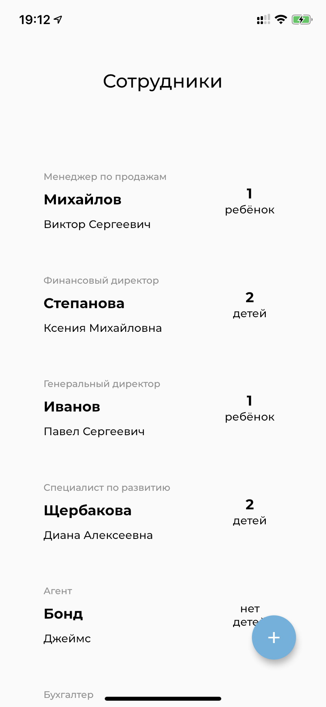
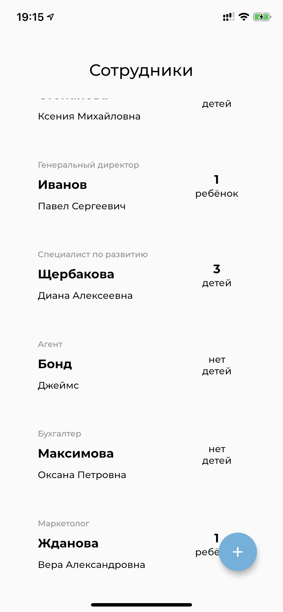
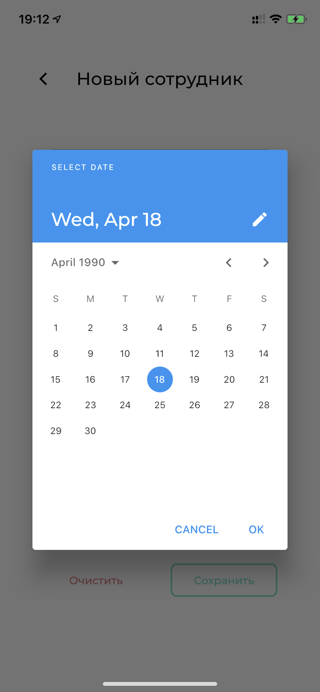
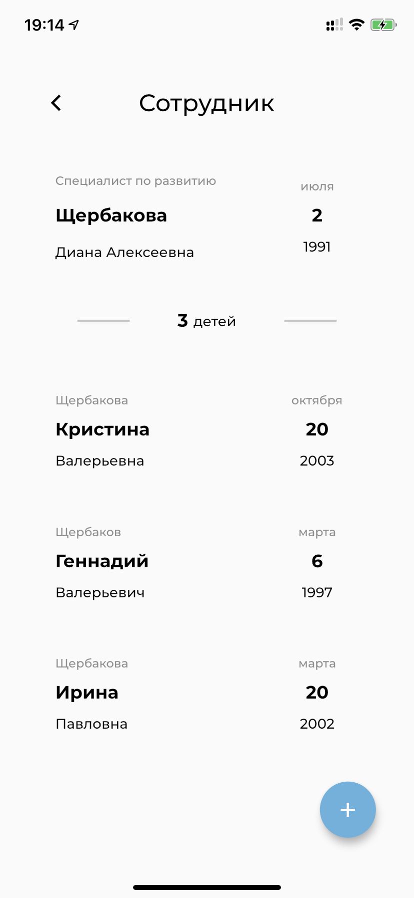
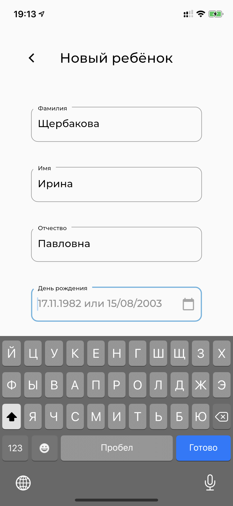

# Тестовое Flutter-приложение для работы с базой данных о сотрудниках и их детях

## Данные

При первом запуске подтягиваются подготовленные данные из [файла](assets/example_data.json). Далее приложение сохраняет и считывает данные из локального .json файла.

## Список сотрудников

Отображены ФИО, должность и количество детей каждого сотрудника. Возможные действия: переход на экран сотрудника и добавление нового сотрудника.

 

## Экран добавления сотрудника

После ввода фамилии, имени, отчества (опционально), должности и даты рождения (в форматах "ДД.ММ.ГГГГ" или "ДД/ММ/ГГГГ"), активируется кнопка сохранения нового сотрудника. Возможные действия: возврат на предыдущий экран, очистка всех полей, вызов панели выбора даты рождения и сохранение сотрудника с автоматическим возвратом на предыдущий экран.

 

## Экран сотрудника

Отображены ФИО, должность, дата рождения, количество детей и их список с указанием ФИО и даты рождения каждого. Возможные действия: возврат на предыдущий экран и добавление нового ребёнка.

 

## Экран добавления ребенка

Аналогичен экрану добавления сотрудника, за исключением отсутствия поля должности.

 
